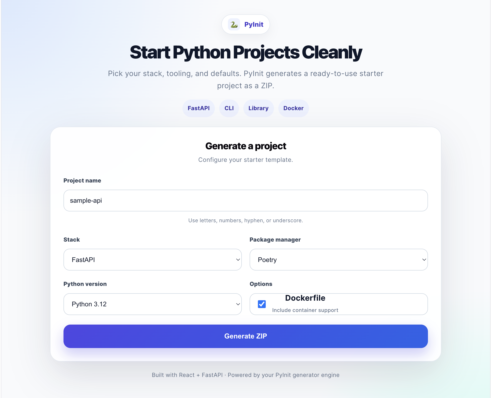
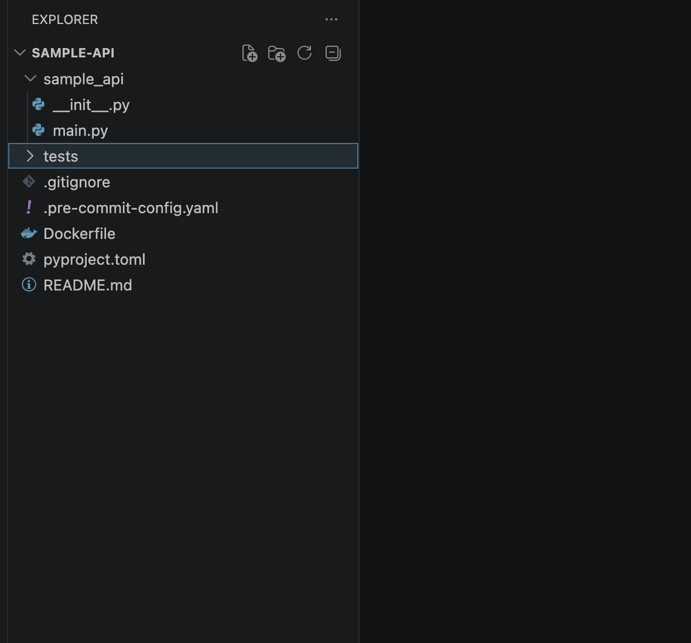

# PyInit

PyInit is an open-source Python project generator that creates a ready-to-use project structure for common Python applications.

The goal of PyInit is simple: reduce the repetitive work involved in starting a new Python project. Instead of creating the same folders, configuration files, and boilerplate code every time, PyInit generates a clean project that is ready for development.

The project currently supports three templates:

- Python Library
- Command Line Interface (CLI)
- FastAPI

PyInit also includes a React-based web interface and a FastAPI backend, allowing projects to be generated from either the command line or a browser.

---

## Background

I built PyInit after noticing that every new Python project started the same way.

Whether I was creating a library, a CLI application, or a FastAPI service, I repeatedly created the same folders, copied the same configuration files, configured a package manager, added a `.gitignore`, and optionally added Docker support.

PyInit automates those repetitive tasks while keeping the generated projects simple and easy to customize.

The project was also an opportunity to learn more about Python packaging, project templating, FastAPI, React, testing, and building a complete developer tool from scratch.

---

## Screenshots

### PyInit Web Interface



### Generated Project



---

## Features

- Generate Python projects from reusable templates
- Python Library template
- CLI application template
- FastAPI template
- Optional Docker support
- Select Poetry, Hatch, or PDM as the package manager
- Choose the target Python version
- Download generated projects as ZIP files
- REST API for project generation
- React web interface
- Command-line interface
- Automated tests for project generation

---

## Project Structure

```
pyinit-generator/
│
├── pyinit/          # Core generator
├── pyinit_web/      # FastAPI backend
├── pyinit_ui/       # React frontend
├── tests/           # Generator tests
├── pyproject.toml
└── README.md
```

---

## Architecture

```
                React UI
                    │
                    ▼
            FastAPI Backend
                    │
                    ▼
           Project Generator
                    │
                    ▼
          Template Processing
                    │
                    ▼
            Generated ZIP File
```

---

## Requirements

- Python 3.10+
- Node.js 18+
- npm
- Poetry

---

## Getting Started

Clone the repository.

```bash
git clone https://github.com/vanivw/pyinit-generator.git
cd pyinit-generator
```

Install Python dependencies.

```bash
poetry install
```

Install frontend dependencies.

```bash
cd pyinit_ui
npm install
```

---

## Running the CLI

Generate a FastAPI project.

```bash
pyinit new my-api --stack fastapi
```

Generate a CLI project.

```bash
pyinit new my-cli --stack cli
```

Generate a Python library.

```bash
pyinit new my-library --stack lib
```

---

## Running the Backend

```bash
cd pyinit_web
poetry install
poetry run uvicorn pyinit_web.main:app --reload
```

Open Swagger UI:

```
http://localhost:8000/docs
```

---

## Running the Frontend

```bash
cd pyinit_ui
npm install
npm run dev
```

Open:

```
http://localhost:5173
```

---

## Running Tests

Run all tests from the project root.

```bash
pytest
```

---

## Roadmap

Planned improvements include:

- Additional project templates
- Automatic development environment setup
- More template customization
- Improved project recommendations

---

## Contributing

Contributions are welcome.

If you find a bug, have an idea for a new template, or would like to improve the project, feel free to open an issue or submit a pull request.

---

## License

This project is licensed under the MIT License.